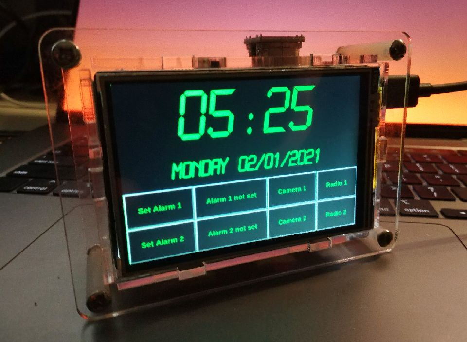

# Touch_Alarm_Clock
Touch Alarm clock written in Python intended for use with the Raspberry Pi

Features 
2 alarms
2 radio streams
2 camera feeds

Configure your cchices at the top of the script.

Must pip install tkinter pygame and vlc

